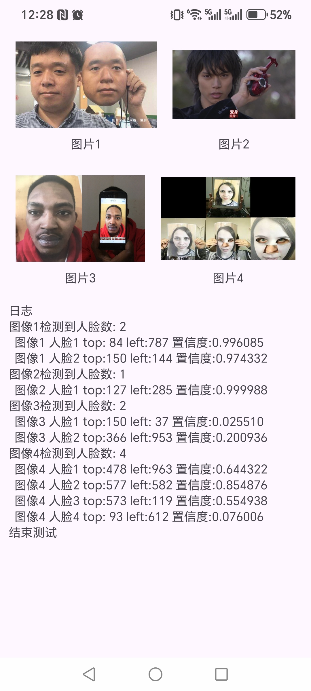

# 安卓静默活体检测 Android-Silent-Face-Anti-Spoofing

本项目使用MIT协议，如果您想要使用本项目，请仔细阅读MIT协议。

如果有任何疑问，请发 email 至 <zirui.gong@foxmail.com> ,或者提交issue。

This software uses the MIT LICENSE. If you wish to use this software, please carefully read the text of the MIT LICENSE.

If you have any questions, please send an email to <zirui.gong@foxmail.com>, or submit an issue.

## 简介

本项目基于小视科技 (Minivision) [安卓平台静默活体检测代码](https://github.com/minivision-ai/Silent-Face-Anti-Spoofing-APK) (Apache-2.0 license) 进行了二次开发。

- 编译了原项目的 c++ 代码, 可以直接复制 app/src/main/jniLibs 中的 so 库进行后续项目的开发
- 重构了原项目的代码, 将原项目中 kotlin 语言的代码全部翻译成 java 语言, 供熟悉 java 的开发者使用
- 增加项目所需的代码注释

测试所用的图片源自网络, 如有侵权请联系

### api概览

app/main/java/com/mv/EngineWrapper.java

```java
    /**
     * 需要调用init来初始化, 调用destroy来销毁对象
     *
     * @param assetManager 通过getAssets获取
     */
    public EngineWrapper(AssetManager assetManager);
    
    /**
     * 初始化模型
     *
     * @return 成功初始化与否. 如果失败, 则检查asset目录是否正确存放了模型配置文件
     * @throws JSONException asset文件live/config.json解析json错误
     * @throws IOException   asset文件live/config.json读取错误
     */
    public boolean init() throws JSONException, IOException;

    /**
     * 销毁对象, 释放资源
     */
    public void destroy();
    
    /**
     * 识别图片中的人脸, 并检测活体
     *
     * @param bitmap 人脸
     * @return 检测结果列表
     */
    public List<DetectionResult> detect(Bitmap bitmap);
    
    /**
     * 识别图片中的人脸, 并检测活体
     *
     * @param yuv         输入, YUV格式(NV21)的图片, 可以通过ImageUtils.bitmapToNv21转化
     * @param width       图片宽度
     * @param height      图片高度
     * @param orientation 图片朝向(取值范围1-8). 代表对图片进行不同处理.
     *                    <p>1: 不处理</p>
     *                    <p>2: 水平翻转</p>
     *                    <p>3: 先水平翻转 然后垂直翻转</p>
     *                    <p>4: 垂直翻转</p>
     *                    <p>5: 转置</p>
     *                    <p>6: 顺时针旋转90度</p>
     *                    <p>7: 水平、垂直翻转 然后转置</p>
     *                    <p>8: 逆时针旋转90度</p>
     * @return 检测结果列表
     */
    public List<DetectionResult> detect(byte[] yuv, int width, int height, int orientation);
```

### 如何使用

想要使用活体检测库, 需要

- 将 app/src/main/java 下的 com/mv/* 拷贝至项目代码目录, 不能改变 java 代码的包结构
- 将 app/src/main/jniLibs 下的所有 so 库拷贝至项目存放 so 库的路径
- 将 app/src/main/assets 下的所有内存拷贝至项目的 assets 目录

### 文件目录说明

- app/src/main/assets: APP 的 Assets 目录

存放活体检测模型的模型和配置文件, 包含人脸识别 (detection) 和活体检测 (live) 的模型. 不建议修改内容和目录结构, 模型仅能从 Assets 中加载.

- app/src/main/jniLibs: APP 默认的 so 库存放路径

包含 arm64 和 arm32 两个平台的动态库文件, 适用于绝大部分手机. 

- app/src/main/res: APP 的资源目录

除了必要的布局样式外, raw 目录下存放了 4 张用于测试的图片

- app/src/main/java: 项目代码目录

其中 com.mv 是活体检测算法库, com.livedetect.MainActivity 是 demo


## 相关连接

- [小视科技静默活体检测项目-PC平台](https://github.com/minivision-ai/Silent-Face-Anti-Spoofing)
- [小视科技静默活体检测项目-安卓平台](https://github.com/minivision-ai/Silent-Face-Anti-Spoofing)

## 权利与说明

本软件是AS IS的( 不提供任何保证， ( 不管是显式的还是隐式的，包括但不限于适销性保证、适用性保证、非侵权性保证 ) ) ，在任何情况下， ( 对于任何的权益追索、损失赔偿或者任何追责 ) ，作者或者版权所有人都不会负责。( 无论这些追责产生自合同、侵权，还是直接或间接来自于本软件以及与本软件使用或经营有关的情形 )

THE SOFTWARE IS PROVIDED "AS IS", WITHOUT WARRANTY OF ANY KIND, EXPRESS OR IMPLIED, INCLUDING BUT NOT LIMITED TO THE WARRANTIES OF MERCHANTABILITY, FITNESS FOR A PARTICULAR PURPOSE AND NONINFRINGEMENT. IN NO EVENT SHALL THE AUTHORS OR COPYRIGHT HOLDERS BE LIABLE FOR ANY CLAIM, DAMAGES OR OTHER LIABILITY, WHETHER IN AN ACTION OF CONTRACT, TORT OR OTHERWISE, ARISING FROM, OUT OF OR IN CONNECTION WITH THE SOFTWARE OR THE USE OR OTHER DEALINGS IN THE SOFTWARE.

## 示例

